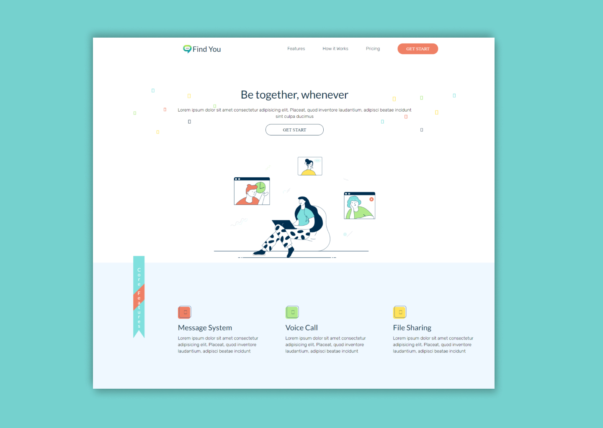
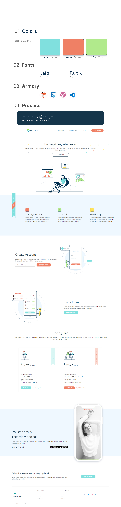

### FindYou---App Landing Page

<br />
<p align="center">
  <a href="https://github.com/m90khan/Find-You-App-Features-Page/">
    
  </a>

  <h3 align="center">FindYou   </h3>

  <p align="center"> App Landing Page
<br />
    <a href="m90khan@gmail.com"><strong>Contact Me</strong></a>
    <br />
    <br />
    <a href="https://github.com/m90khan/Find-You-App-Features-Page/">View Demo</a>
    
   </p>
</p>

### About the Project

- App landing page for a chat application

Live: https://github.com/m90khan/Find-You-App-Features-Page/

Duration: 10 hrs - 3 days split



---

#### Process

- Setup environment for final css will be compiled
- Implementation of HTML structure
- Applied component based styling



---

### Skills

[][youtube]
[][youtube]
[][youtube]
[][youtube]
[][youtube]
[][youtube]
[][youtube]
<br />
<br />

---

### Code Snippet

```scss
.pricing {
  @include flex(row, center, center);
  justify-content: space-around;
  flex-wrap: wrap;
  padding: 5rem 10rem;
  @include respond(phone) {
    padding: 2rem 1rem;
  }
  &-box {
    border: 1px solid rgba($color-black, 0.1);
    flex: 1 1 35rem;
    &:not(:last-child) {
      margin-right: 5rem;
      @include respond(ths-port) {
        margin-right: 0;
        margin-bottom: 2rem;
      }
    }

    &-header {
      border-bottom: 1px solid rgba($color-black, 0.1);
      padding: 5rem 3rem;
      position: relative;

      &image1 {
        width: 50%;
      }

      &__time {
        font-size: var(--p);
      }
    }
    &-main {
      padding: 4rem 3rem;
      ul {
        li {
          padding: 0.6rem;
        }
      }
      p {
        margin-left: 2rem;
        display: inline-block;
      }
    }
  }
}
```

---

### Connect with me:

[][youtube]

[][twitter]
[][linkedin]
[][instagram]
[][behance]
[][dribble]
<br />

---

[youtube]: https://www.youtube.com/channel/UC96rVfdTKsjZpREnH6CaCOw
[twitter]: https://twitter.com/m90khan
[linkedin]: https://www.linkedin.com/in/uxdkhan
[instagram]: https://www.instagram.com/uxd.khan/
[behance]: https://www.behance.net/Khan_Mohsin
[dribble]: https://dribbble.com/uxdkhan
